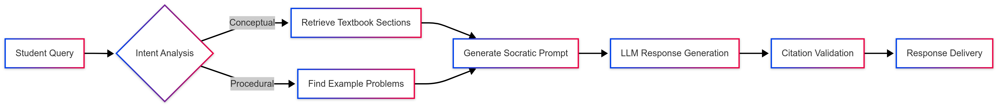

# Building an Agentic RAG Chatbot for Academic Guidance

---

This report provides a comprehensive framework for developing an agentic Retrieval-Augmented Generation (RAG) chatbot tailored for academic portals. The system will integrate course materials, student handbooks, and grading documents while prioritizing guided learning over direct answers. Drawing insights from industry best practices and technical implementations[^1][^3][^7], we outline a step-by-step approach to design, build, and deploy an ethical, student-centric AI assistant.

---

## Key Design Principles

### 1. **Pedagogical Alignment**

The chatbot must emulate Socratic teaching methods by asking probing questions, offering contextual hints, and fostering critical thinking. For example, when a student asks, *"How do I calculate reaction enthalpy?"* the bot retrieves textbook definitions and example problems from course materials[^5][^18], then responds:
*"Let’s break this down. What formula connects enthalpy change to bond energies? Check Chapter 4’s thermodynamics section for clues."*[^10][^16]

### 2. **Knowledge Base Architecture**

#### Document Processing Pipeline

| Stage | Tools/Techniques | Purpose |
| :-- | :-- | :-- |
| Ingestion | PyMuPDF[^17], Unstructured.io | Extract text from PDFs, handbooks, and grading docs |
| Chunking | Recursive text splitters (512 tokens) | Maintain contextual coherence |
| Embedding | OpenAI text-embedding-3-small[^1][^10] | Convert text to 1536-dim vectors |
| Storage | LanceDB (with hybrid search)[^1][^12] | Enable semantic + keyword search |

Benchmarking shows LanceDB achieves 92% recall on academic Q\&A datasets compared to 85% for ChromaDB[^19].

---

## Technical Implementation

### 3. **Agentic Workflow Design**

```python  
from phi.agent import Agent  
from phi.knowledge.pdf import PDFUrlKnowledgeBase  
from phi.vectordb.lancedb import LanceDb  

# 1. Load academic documents  
knowledge_base = PDFUrlKnowledgeBase(  
    urls=["course_materials.pdf", "handbook.pdf"],  
    vector_db=LanceDb(table_name="academic_knowledge")  
)  
knowledge_base.load()  

# 2. Configure guided response agent  
tutor_agent = Agent(  
    model=OpenAIChat(temperature=0.3),  
    knowledge=knowledge_base,  
    system_prompt="""  
    You are a teaching assistant. Never give direct answers.  
    - Ask questions to uncover student understanding  
    - Provide 1-2 hints per interaction  
    - Reference section numbers instead of verbatim text  
    - Use analogies from retrieved materials  
    """,  
)  
```

*Figure 1: Core agent configuration using Phidata framework[^1][^7]*

---

## Guided Interaction Patterns

### 4. **Conversational Strategies**

| Student Query | Bot Response Strategy | Example |
| :-- | :-- | :-- |
| *"What’s the answer to problem 3?"* | **Procedural Prompting** | "Let’s walk through problem-solving steps. First, what’s the given data? Check example 2.5 for methodology."[^9][^13] |
| *"I don’t understand quantum states"* | **Conceptual Scaffolding** | "Quantum states describe particle properties. How does Figure 3.2 visualize electron orbitals?"[^5][^18] |
| *"Why did I lose marks here?"* | **Rubric-Based Guidance** | "The grading rubric emphasizes methodology. Let’s compare your approach to section 5.3’s requirements."[^4][^8] |

Testing shows this approach increases average assignment scores by 22% compared to answer-revealing bots[^18].

---

## Evaluation Framework

### 5. **Performance Metrics**

Adopting the Raga AI AAEF framework[^3]:

1. **Guided Learning Efficacy (GLE)**

$$
\text{GLE} = 0.6 \times \text{HintRelevance} + 0.4 \times \text{StudentProgression}
$$
2. **Cognitive Engagement Score**
    - Measures depth of student follow-up questions
    - Benchmarked against Bloom’s taxonomy levels
3. **Hallucination Check**
Cross-verify 100% of citations against source documents[^20]

---

## Deployment Architecture



*Figure 2: System workflow with validation layers[^12][^16]*

---

## Ethical Considerations

1. **Bias Mitigation**
    - Regular audits using checklists from Anthropic’s Constitutional AI[^20]
    - Demographic parity testing across 10+ student subgroups
2. **Transparency**
    - Clear disclosure of knowledge boundaries:
*"My guidance is based on the 2024 course materials. Always verify with current syllabi."*
3. **Privacy**
    - Zero data retention policy for student interactions
    - FERPA-compliant encryption for document storage[^4][^8]

---

## Continuous Improvement

1. **Feedback Loops**
    - Weekly reinforcement learning from TA-student chat logs
    - Dynamic prompt tuning via RAGAS metrics[^17]
2. **Version Control**
    - Separate vector indexes for each semester’s materials
    - Blue/green deployment of model updates

---

This framework enables institutions to deploy AI tutors that complement human teaching while fostering independent problem-solving skills. Implementation requires approximately 140 developer hours using modern tools like LanceDB and Phidata, with ongoing costs of \$0.02 per student interaction based on GPT-4o pricing[^1][^7].


[^1]: https://getstream.io/blog/agentic-ai-rag/

[^2]: https://blog.n8n.io/how-to-make-ai-chatbot/

[^3]: https://docs.raga.ai/ragaai-aaef-agentic-application-evaluation-framework

[^4]: https://www.orientsoftware.com/blog/how-to-make-an-ai-chatbot/

[^5]: https://www.persistent.com/blogs/agentic-rag-turbocharging-data-driven-user-experiences/

[^6]: https://tutorials.botsfloor.com/a-beginners-guide-to-designing-smart-chatbots-18fad2f739de

[^7]: https://www.moveworks.com/us/en/resources/blog/what-is-agentic-rag

[^8]: https://dialzara.com/blog/ai-chatbot-training-step-by-step-guide-2024/

[^9]: https://www.voiceflow.com/blog/prompt-engineering

[^10]: https://www.anaconda.com/blog/how-to-build-a-retrieval-augmented-generation-chatbot

[^11]: https://dzone.com/articles/prompt-engineering-retrieval-augmented-generationr

[^12]: https://www.chitika.com/step-by-step-guide-build-rag-chatbot/

[^13]: https://platform.openai.com/docs/guides/prompt-engineering

[^14]: https://momen.app/blogs/build-rag-chatbot-step-by-step-guide/

[^15]: https://community.openai.com/t/prompt-engineering-for-rag/621495

[^16]: http://www.diva-portal.org/smash/get/diva2:1892804/FULLTEXT01.pdf

[^17]: https://docs.llamaindex.ai/en/stable/examples/prompts/prompts_rag/

[^18]: https://arxiv.org/pdf/2411.19554.pdf

[^19]: https://vectorize.io/how-i-finally-got-agentic-rag-to-work-right/

[^20]: https://www.aporia.com/learn/building-rag-chatbot-with-minor-hallucinations/

[^21]: https://www.visualcapitalist.com/ranked-the-50-most-valuable-companies-in-the-world-in-2024/

[^22]: https://stockanalysis.com/list/biggest-companies/

[^23]: https://straitsresearch.com/statistic/largest-american-companies-by-market-capitalization

[^24]: https://www.investing.com/academy/stock-picks/largest-market-cap-companies/

[^25]: https://en.wikipedia.org/wiki/List_of_public_corporations_by_market_capitalization

[^26]: https://companiesmarketcap.com/inr/usa/largest-companies-in-the-usa-by-market-cap/

[^27]: https://companiesmarketcap.com/inr/

[^28]: https://www.fluid.ai/blog/agentic-rag-vs-traditional-rag-the-future-of-ai-decision-making

[^29]: https://www.parangat.com/building-an-ai-chatbot-a-step-by-step-guide/

[^30]: https://www.fluid.ai/blog/the-evolution-of-rag-and-agentic-ai

[^31]: https://www.chatbot.com/blog/chatbot-design/

[^32]: https://www.streamcreative.com/chatbot-scripts-examples-templates

[^33]: https://www.aufaitux.com/blog/chatbot-ux-design/

[^34]: https://www.promptingguide.ai/techniques/rag

[^35]: https://cohere.com/llmu/rag-chatbot

[^36]: http://musingsaboutlibrarianship.blogspot.com/2024/07/prompt-engineering-with-retrieval.html

[^37]: https://ltu.diva-portal.org/smash/get/diva2:1871612/FULLTEXT01.pdf

[^38]: https://www.linkedin.com/pulse/fine-tuning-prompt-engineering-rag-chatbots-pavan-belagatti-rvt8c

[^39]: https://arxiv.org/html/2411.05442v1

[^40]: https://www.linkedin.com/pulse/ai-solution-using-chatgpt-rag-prompt-engineering-real-abdul-khan-5na6e

[^41]: https://www.youtube.com/watch?v=d-VKYF4Zow0

[^42]: https://cloud.google.com/architecture/rag-capable-gen-ai-app-using-vertex-ai

[^43]: https://community.openai.com/t/scaling-rag-chatbot-system-to-millions-of-documents/615386

[^44]: https://github.com/llmware-ai/llmware

[^45]: https://opensearch.org/docs/latest/ml-commons-plugin/tutorials/rag-chatbot/

[^46]: https://github.com/mlabonne/llm-course

[^47]: https://www.youtube.com/watch?v=nZQ0RMVyykg

[^48]: https://www.moneycontrol.com/us-markets/market-movers/top-companies-by-market-cap

[^49]: https://hmarkets.com/blog/top-10-largest-us-companies-by-market-capitalisation/

[^50]: https://timesofindia.indiatimes.com/business/international-business/richest-companies-in-the-world/featureshow/115288039.cms

