# Team31 Project

A modern frontend application built with Vue.js and Vite. This project provides a user-friendly interface for managing courses, deadlines, feedback, and more, tailored for students, instructors, and administrators.

The main focus is on the AI insights for students and as well as instructors. This web app also has built in chatbot for students to intreact on the go while watching a lecture and can ask any questions regarding it, enabling faster learnign experiecne and have a tutor buddy.

## Installation front-end

1. **Go to the repository**:
   ```bash
   cd vue-project
   ```

2. **Install dependencies**:
   ```bash
   npm install
   ```

3. **Run the development server**:
   ```bash
   npm run dev
   ```

4. **Open the app**:
   Visit `http://localhost:5173` in your browser.

## Installation back-end

1. **Go to the repository**
    ```bash
   cd backend
   ```

2. **Create a virtual environment**
   ```bash
   python3 -m venv venv
   ```

3. **Activate the virtual environment**
   ```bash
   source venv/bin/activate
   ```

4. **Install dependencies**
   ```bash
   pip install -r requirements.txt
   ```

5. **Create environment variable for AI part**
   ```bash
   touch .env

   'ADD THE FOLLOWING IN THE .env FILE'

   GEMINI_API_KEY='YOUR API KEY'
   YOUTUBE_API_KEY='YOUR API KEY'
   ```

5. **Run the development server**
   ```
   python3 app.py
   ```

### Home Page
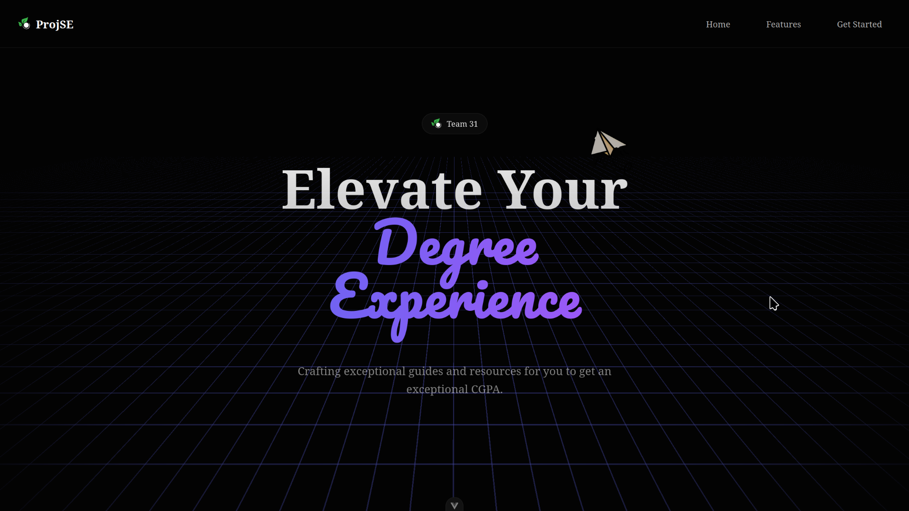

### Sign In
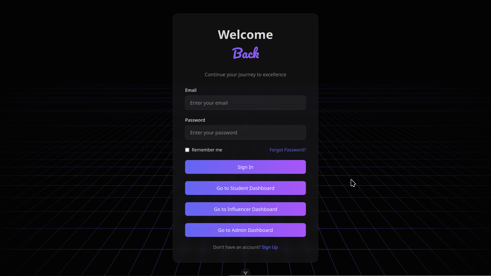

### Sign Up
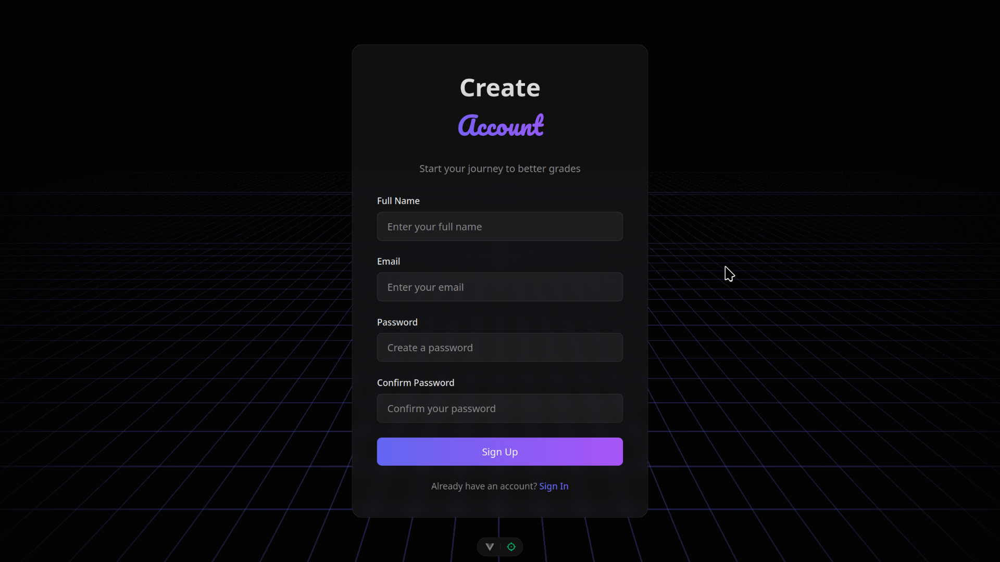

### Student Dashboard
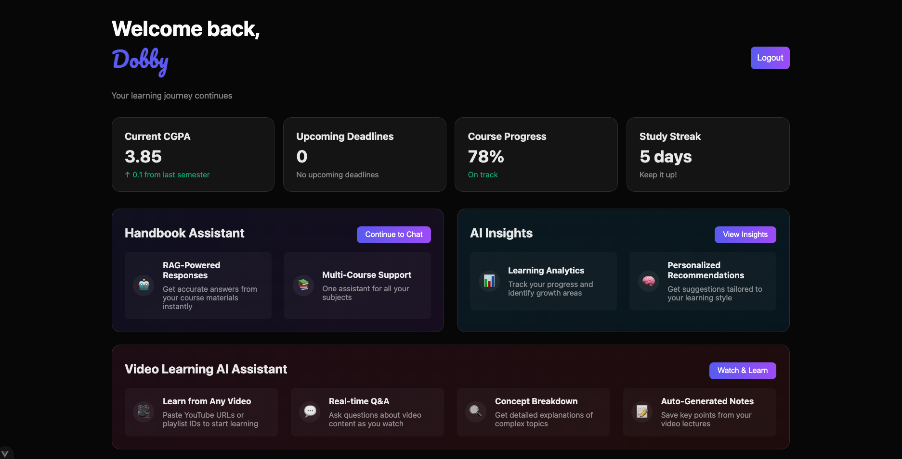


### Student Feedback Form
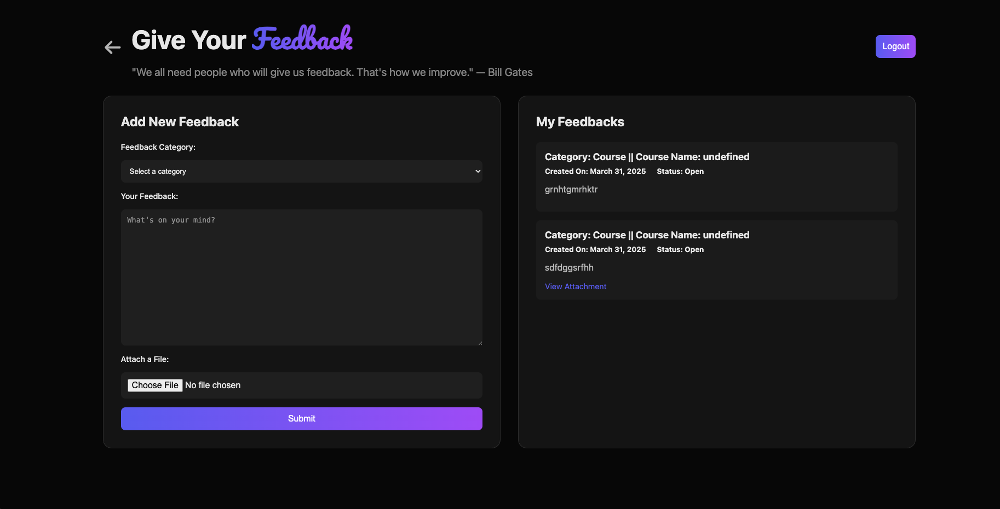

### Deadline Section
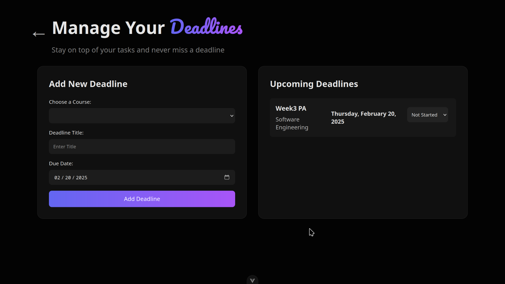

### Student AI Insights
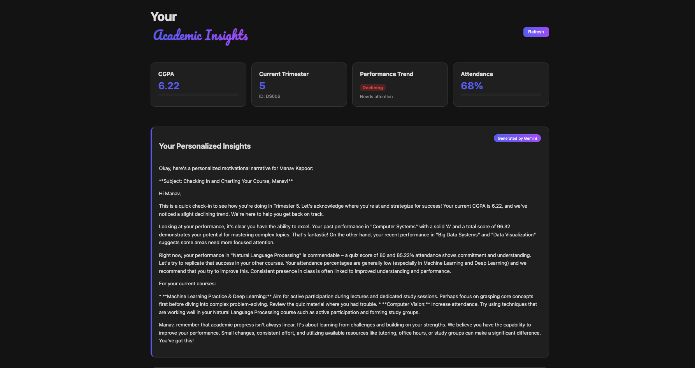

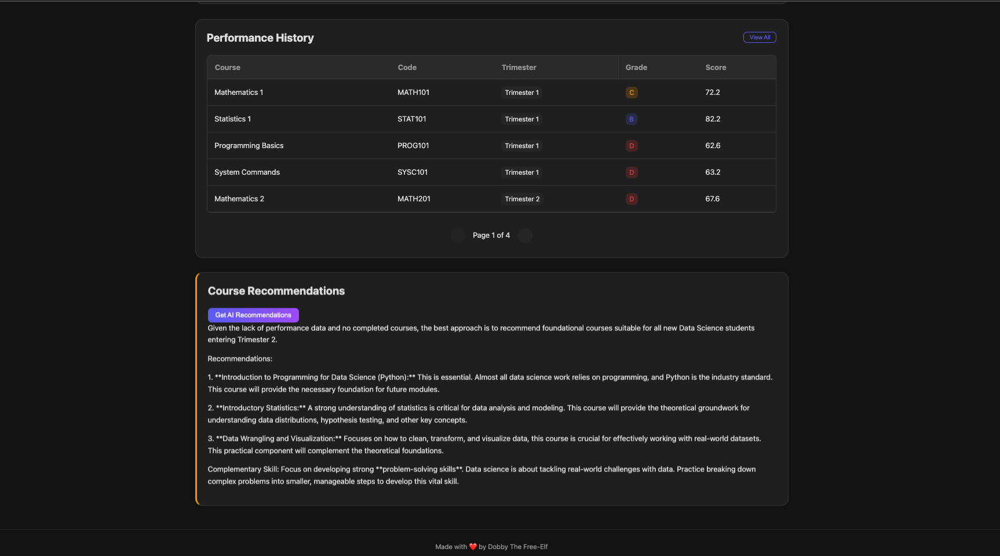

### Handbook Chatbot Interface
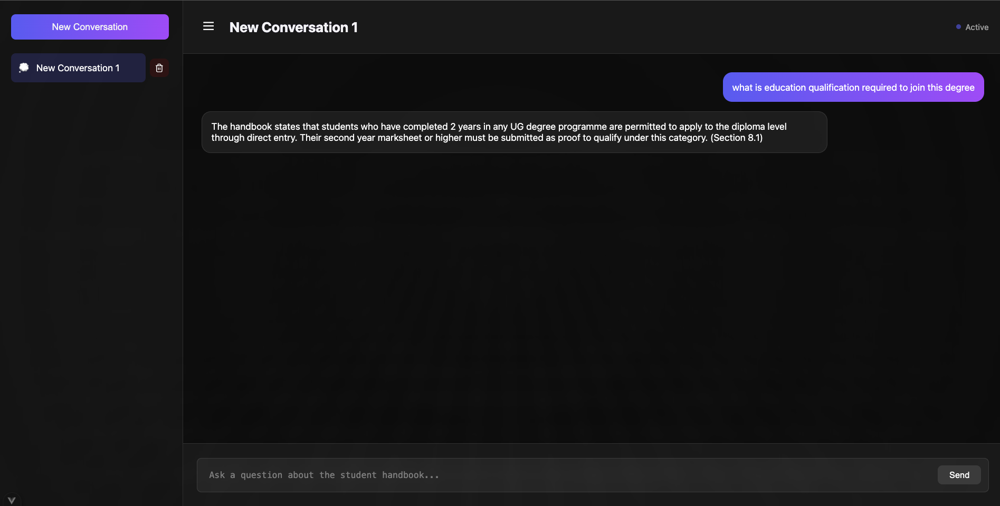

## Video Chatbot Interface


### Instructor Dashboard
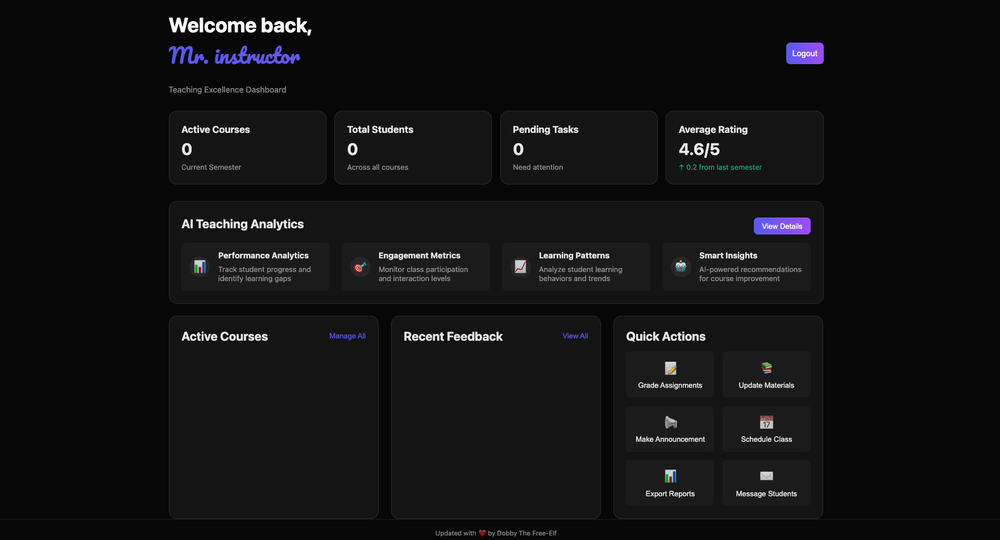

## Instructor AI Insights
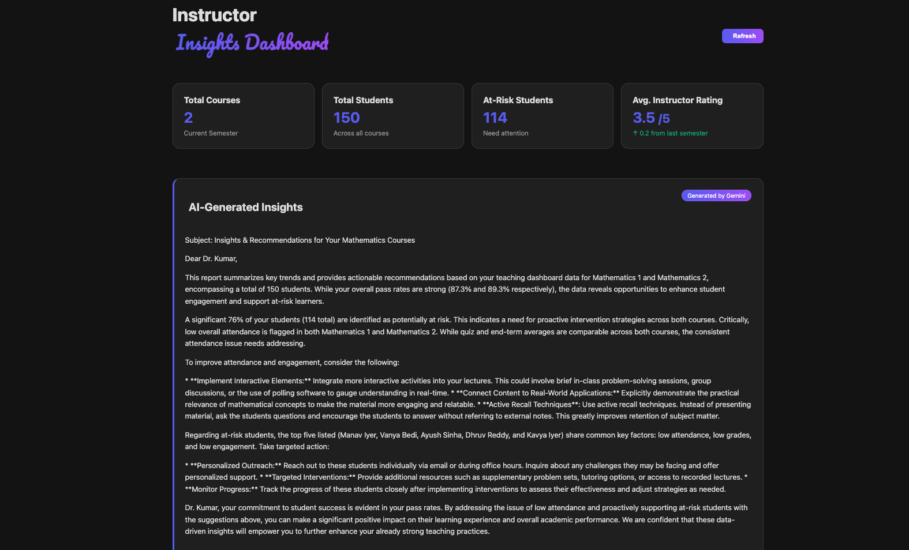

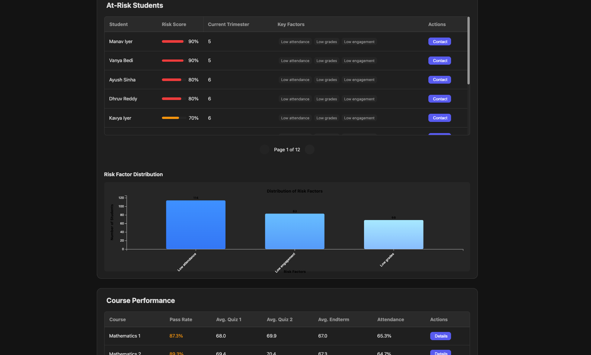

### Course Management
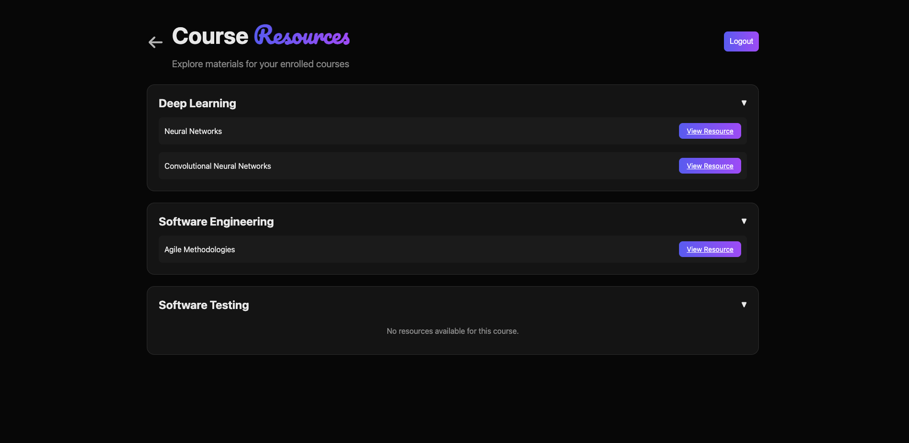

### Instructor Feedback
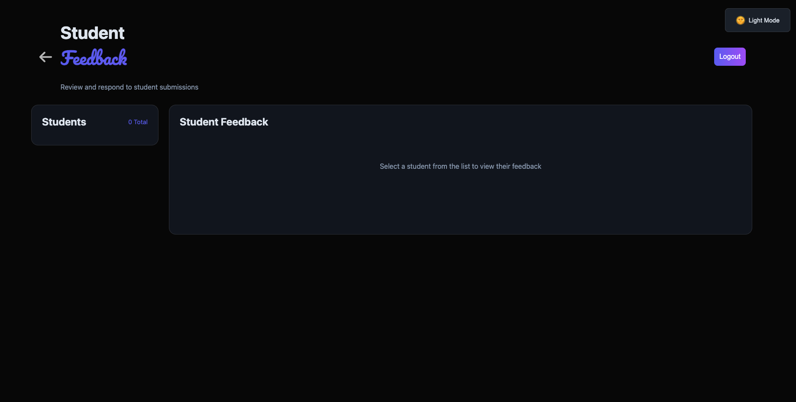

### Admin Dashboard
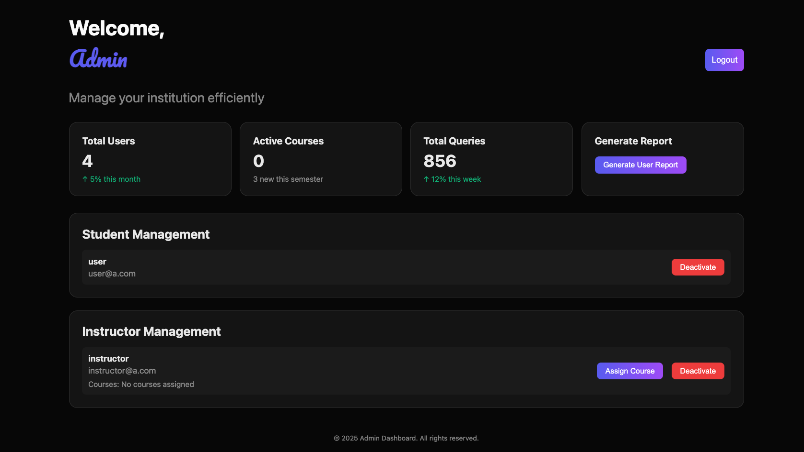

---

