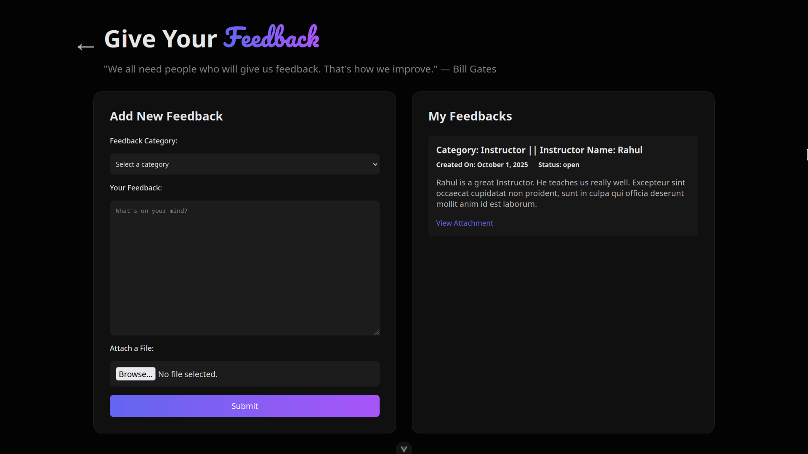

# Team31 Project

A modern frontend application built with Vue.js and Vite. This project provides a user-friendly interface for managing courses, deadlines, feedback, and more, tailored for students, instructors, and administrators.

## Installation

1. **Go to the repository**:
   ```bash
   cd vue-project
   ```

2. **Install dependencies**:
   ```bash
   npm install
   ```

3. **Run the development server**:
   ```bash
   npm run dev
   ```

4. **Open the app**:
   Visit `http://localhost:5173` in your browser.


### Home Page


### Sign In


### Sign Up


### Student Dashboard


### Instructor Dashboard


### Admin Dashboard


### Course Management


### AI Summary


### Feedback Form


### Instructor Feedback


### Chat Interface


### Deadline Section


### Course Resource


---

